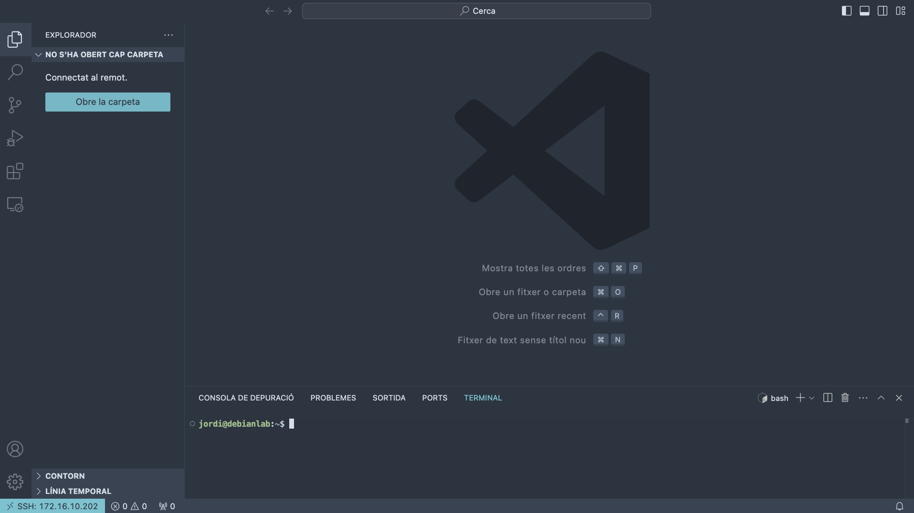
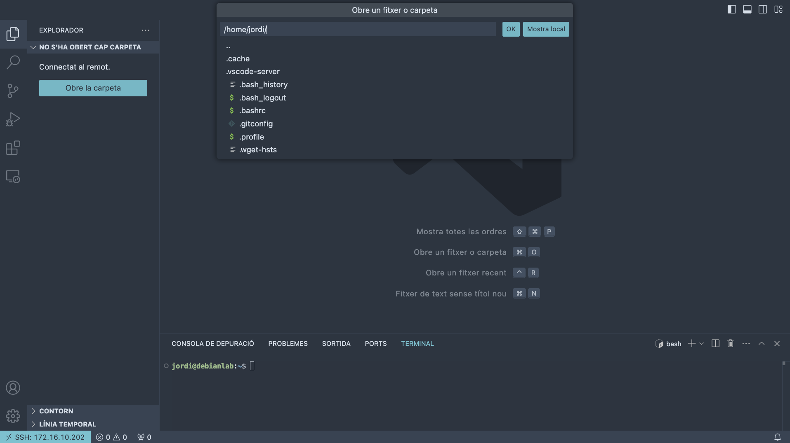
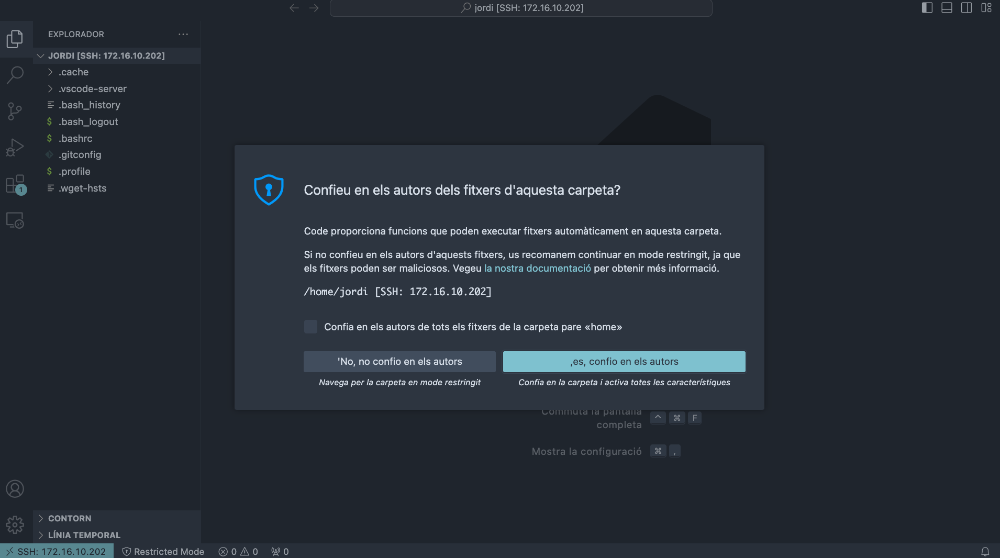
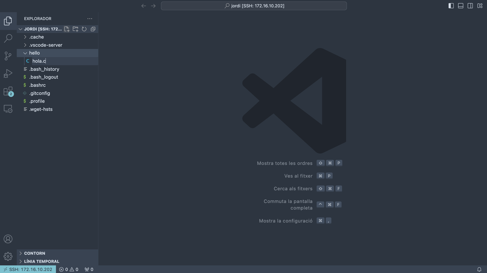
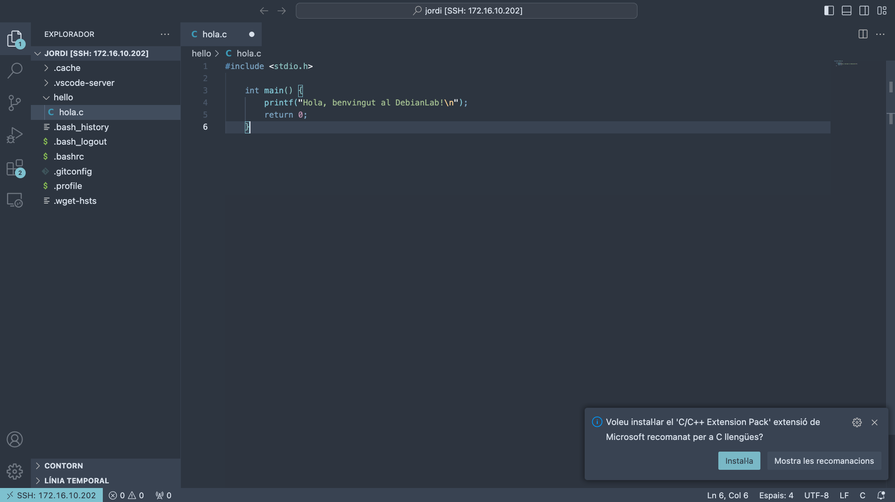
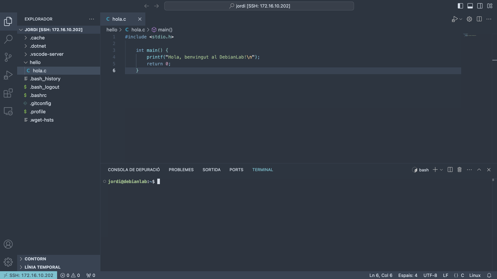
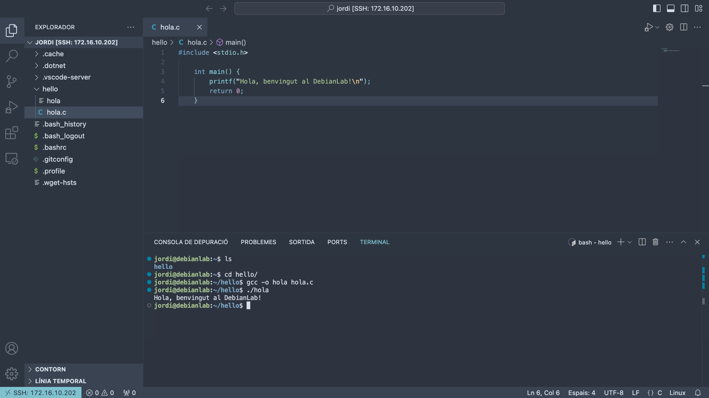

# Configurant l'Entorn de Desenvolupament

Per instal·lar el llenguatge de programació **C a Debian**, pots seguir aquests passos:

1. Connecta una terminal al teu sistema Debian i obra una sessió com a usuari **root**.

    ```sh
    su -
    ```

2. Instal·la el paquet *build-essential*, que inclou les eines i llibreries necessàries per compilar i construir programes en C. Aquest paquet inclou el compilador GCC, que és comunament utilitzat per programar en C.

    ```sh
    apt install build-essential -y
    ```

3. Torna a la sessió com a usuari normal i comprova que el compilador GCC s'ha instal·lat correctament.Verifica la instal·lació comprovant la versió del compilador GCC instal·lat.

    ```sh
    exit
    gcc --version
    ```

Ara ja pots escriure i compilar programes en *C* al teu sistema Debian. Com anteriorment, has vinculat VSCode amb la màquina virtual **debianlab** ara pots escriure i compilar programes en C des de l'entorn de desenvolupament **VSCode**.

Anem a crear un programa senzill en C, compilar-lo i executar-lo. Aquest programa mostrarà un missatge de benvinguda a la terminal.

1. Fer click al boto **Obre la Carpeta**.

    

2. Selecciona la carpeta de l'usuari. (*/home/jordi*). Això obrirà la carpeta de l'usuari a la barra lateral esquerra de VSCode.

    

   - Confirmeu que confieu en l'origen de la carpeta seleccionada.

    

   - Com a resultat, la carpeta de l'usuari s'obrirà a la barra lateral esquerra de VSCode.

    

3. Crea un directori utilitzant el gestor de fitxers de VSCode. Per exemple, crea un directori anomenat `hello` a la carpeta de l'usuari.

    

4. Crear un nou fitxer anomenat `hola.c` dins del directori `hello`.

    

5. Utilitza l'editor de text de VSCode per escriure el següent codi en C al fitxer creat.

    ```c
    #include <stdio.h>

    int main() {
        printf("Hola, benvingut al DebianLab!\n");
        return 0;
    }
    ```

    

    Podeu seleccionar instal·lar l'extensió C/C++ per a VSCode tal com us recomana l'editor.

    Un cop instal·lat, torneu a la pestanya de l'editor de `hola.c` i guardeu el fitxer.

    > **😵‍💫 Trobleshooting:**
    >
    > Si quan guardeu el fitxer, VSCode us mostra la llibreria stdio.h amb vermell indicant que no la troba, simplement, tanqueu la sessió a VSCode i torneu-la a iniciar. Això solucionarà el problema.

6. Si no teniu oberta la terminal, podeu obrir-ne una des de VSCode. Feu clic a **Terminal** i seleccioneu **Nova Terminal**.

    

    Ara podeu compilar el programa des de la terminal de VSCode.

7. Navega fins al directori `hello`.

    ```sh
    cd hello
    ```

8. Compila el programa amb la comanda `gcc`.

    ```sh
    gcc -o hola hola.c
    ```

9. Executa el programa.

    ```sh
    ./hola
    ```


