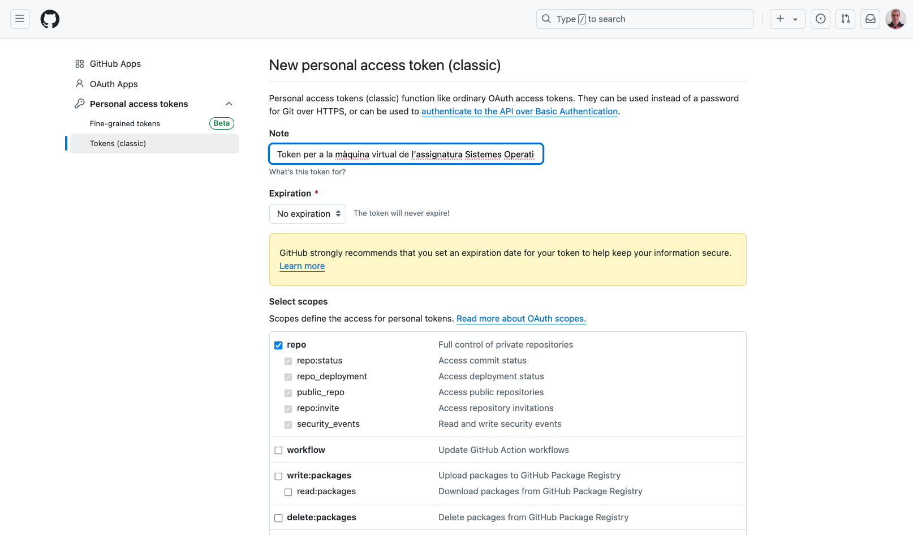

# Configuració Git/Github

## Instal·lació de Git a la màquina virtual

1. Inicieu una sessió a la terminal de la màquina virtual **debianlab**, o bé utilitzeu la terminal de l'entorn de desenvolupament **VSCode**.

2. Inicia la sessió de l'usuari **root** amb la comanda:

    ```sh
    su -
    ```

    El guionet `-` és important perquè carregui correctament les variables d'entorn de l'usuari **root**.

3. Com a usuari **root**. Instal·la el programari **git** amb la comanda:

    ```sh
    apt install git -y
    ```

4. Un cop finalitzi la instal·lació, comproveu la versió de **git** amb la comanda:

    ```sh
    git --version
    ```

Una forma alternativa d'instal·lar **git** en una sola comanda és:

```sh
su -c "apt install git -y"
```

## Configuració de Git

Per començar a treballar amb Git, primer cal configurar el nostre usuari i correu electrònic. Aquesta informació s'utilitzarà per identificar els commits que fem al repositori. Per configurar el nostre usuari i correu electrònic, executem les següents comandes:

```sh
git config --global user.name "JordiMateo"
git config --global user.email "jordi.mateo@udl.cat"
```

Aquestes comandes s'executen en una terminal d'usuari normal, no cal ser **root**.

Aquestes dades es guarden en el fitxer de configuració de l'usuari de Git, que es troba a la carpeta de l'usuari, en un fitxer anomenat `.gitconfig`. Per veure el contingut d'aquest fitxer, executem la comanda:

```sh
cat ~/.gitconfig
```

## Configurant Github

1. Crea un compte a GitHub: Si no tens un compte a GitHub, visita [https://github.com/](https://github.com/) i crea un compte gratuït.

2. Inicia la sessió al teu compte de GitHub en el navegador web.

3. Fes clic a la teva foto de perfil a la cantonada superior dreta i selecciona **Configuració** al menú desplegable.

4. A la pàgina de configuració de GitHub, selecciona **Configuració de desenvolupador** al menú lateral esquerre.

5. A la secció "Tokens personals", fes clic a "Genera un token personal" i selecciona un Token (clássic) per a l'ús amb la línia de comandes.


1. Completa la informació requerida i fes clic a "Generar token":

    - Introdueix un nom per al teu token.

    > 🚀 **Per exemple:**
    >
    > *Token per a la màquina virtual de l'assignatura Sistemes Operatius.*

    - Selecciona un temps d'expiració per al teu token.
  
    > **🧐 Simplicitat:**
    >
    > Podeu posar *no expiration*. Així, el token no caducarà.

    ---

    > **⚠️ Seguretat:**
    > En un entorn real, és recomanable posar una data d'expiració.

    - Selecciona els permisos que vols donar al teu token.
  
    > Per l'assignatura necessiteu marcar la casella **repo** i **workflow**. Aquests permisos són suficients per a clonar, pujar i baixar repositoris i executar accions de GitHub.

    

    - Guarda el token en un lloc segur. No el podreu veure més. Si el perdeu, haureu de generar un nou token.

## Configuració de l'accés a GitHub des de la màquina virtual

1. Inicia una sessió a la terminal de la màquina virtual **debianlab** com a usuari normal.

2. Configura Git per utilitzar el token de GitHub executant la següent comanda:

    ```sh
    git config --global github.token TOKEN
    ```

    > **🔑 Actualitza:**
    >
    > Reemplaça `TOKEN` pel token d'accés que has generat al pas anterior.

    Això emmagatzemarà el token de GitHub en la configuració global de Git al teu sistema Debian.

3. Verifica que el token s'hagi configurat correctament executant:

    ```sh
    git config --global --get github.token
    ```

    Si tot ha anat bé, veuràs el token que has configurat.