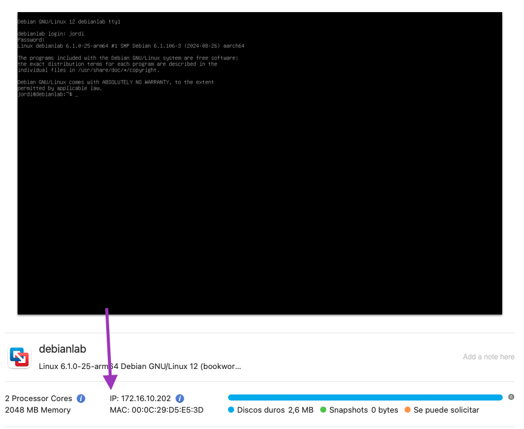
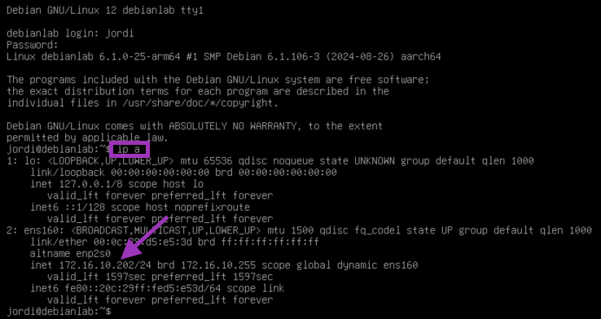
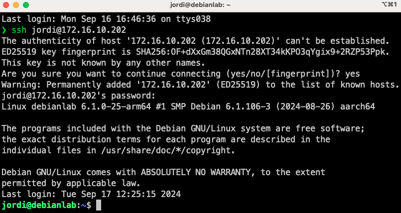

# Conexió remota a la màquina virtual

En els nostres laboratoris, utilitzarem la màquina virtual per realitzar tots els experiments i com a entorn de desenvolupament. Per facilitar la gestió s'acosutma a utilitzar els protocols SSH, SFTP i SCP per connectar-se a la màquina virtual i transferir fitxers entre la vostra màquina local i la màquina virtual.

> ℹ️ Què és SSH?
>
> SSH (Secure Shell) és un protocol de xarxa que permet als usuaris connectar-se a un dispositiu remot de forma segura. SSH utilitza una connexió xifrada per autenticar els usuaris i protegir les dades que es transmeten entre els dispositius. Això fa que SSH sigui una eina molt útil per connectar-se a servidors remots de forma segura.

---

> ℹ️ Què és SFTP?
>
> SFTP (SSH File Transfer Protocol) és un protocol de transferència de fitxers que permet als usuaris transferir fitxers de forma segura entre dos dispositius. SFTP utilitza SSH per autenticar els usuaris i xifrar les dades que es transmeten entre els dispositius. Això fa que SFTP sigui una eina molt útil per transferir fitxers de forma segura entre servidors remots.

---

> ℹ️ Què és secure copy (SCP)?
>
> SCP (Secure Copy) és una eina que permet als usuaris copiar fitxers de forma segura entre dos dispositius utilitzant SSH. SCP utilitza SSH per autenticar els usuaris i xifrar les dades que es transmeten entre els dispositius.

## Connexió SSH entre la vostra màquina i la màquina virtual

Per connectar-vos a una màquina virtual utilitzant SSH, necessitareu l'adreça IP de la màquina virtual o bé el `hostname` de la màquina virtual. A més, necessitareu un client SSH instal·lat al vostre sistema local.

Per obtenir l'adreça IP de la màquina virtual, podeu utilitzar la interfície gràfica de *VMWare* o bé executar la comanda `ip a` a la màquina virtual per obtenir la informació de la xarxa.

- Interfície gràfica de *VMWare*:

  

- Executar la comanda `ip a` a la màquina virtual:

  ```bash
  ip a
  ```

  

  En el meu cas, l'adreça IP de la màquina virtual és `172.16.10.202`.

> 💡 Info :
>
> Per defecte, VMWare utilitza una xarxa NAT per connectar les màquines virtuals. Per fer-ho, VMWare crea una xarxa privada a la qual es connecten les màquines virtuals i utilitza la xarxa de l'amfitrió per connectar-se a Internet. Això permet a les màquines virtuals connectar-se a Internet a través de l'amfitrió sense necessitat de configurar una xarxa addicional. Ara bé, això també significa que les màquines virtuals utilitzen una adreça IP privada que no és accessible des de l'exterior. Tot i això, aquesta configuració la podeu canviar si cal. Però, pels nostres laboratoris, aquesta configuració és suficient.

A continuació, us mostrem com connectar-vos a una màquina virtual utilitzant SSH:

- Mac/Linux:
  
  ```bash
  ssh <usuari>@<adreça IP o hostname>
  ```

 

 **On**: `<usuari>` és el nom d'usuari amb el qual voleu connectar-vos a la màquina virtual i  `<adreça IP o hostname>` és l'adreça IP o el `hostname` de la màquina virtual a la qual voleu connectar-vos.

 > **⚠️ Compte!**
 >
 > Per defecte, Debian no permet l'accés remot amb l'usuari `root`. Per tant, si voleu connectar-vos a la màquina virtual com a `root`, primer heu de connectar-vos com a usuari normal i després canviar a l'usuari `root` amb la comanda `su`.
 >
 > 

  Un cop connectats, podreu interactuar amb la màquina virtual com si estiguéssiu connectats físicament a la màquina. Per sortir de la sessió SSH, executeu la comanda `exit`.

- Windows: Obrir una sessió de PowerShell i executar la comanda anterior. També podeu utilitzar un client SSH com [PuTTY](https://www.putty.org/).

> ℹ️ Què és el fingerprint que es mostra quan connecteu per primera vegada a un servidor SSH?
>
> El fingerprint és una empremta digital única que identifica un servidor SSH. Quan connecteu per primera vegada a un servidor SSH, el vostre client SSH us mostrarà el fingerprint del servidor perquè pugueu verificar que esteu connectant-vos al servidor correcte. Això us protegeix contra atacs de suplantació de servidor.

---

> 😵‍💫 Troubleshooting:
>
> Si una IP d'una màquina virtual a la qual havíeu accedit prèviament es reassigna a una altra màquina virtual i intenteu accedir a la màquina virtual original, el client SSH mostrarà un missatge d'advertència. Això succeeix perquè el fingerprint del servidor ha canviat. Quan connecteu per primera vegada a un servidor SSH, el vostre client SSH emmagatzema aquest fingerprint en el fitxer `~/.ssh/known_hosts` per a futures referències.
>
> Si el fingerprint del servidor canvia (per exemple, perquè l'adreça IP s'ha reassignat a una altra màquina virtual), el client SSH detectarà aquesta discrepància i mostrarà un missatge d'advertència per protegir-vos contra possibles atacs de suplantació de servidor. Aquest missatge us informa que el servidor al qual esteu intentant connectar-vos no coincideix amb el fingerprint emmagatzemat.
>
> Per resoldre aquest problema i poder connectar-vos al servidor, podeu eliminar l'entrada del servidor del fitxer `~/.ssh/known_hosts`. Això permetrà al client SSH acceptar el nou fingerprint i establir la connexió sense mostrar l'advertència.
>
> Per resoldre aquest problema, simplement elimineu l'entrada del servidor del fitxer `~/.ssh/known_hosts` i torneu a intentar connectar-vos al servidor. En el sistema operatiu Windows, el fitxer `known_hosts` es troba a la carpeta `C:\Users\<usuari>\.ssh\known_hosts`.

## Transferència de fitxers amb SFTP

Per transferir fitxers entre la vostra màquina local i la màquina virtual utilitzant SFTP, necessitareu l'adreça IP de la màquina virtual o bé el `hostname` de la màquina virtual. A més, necessitareu un client SFTP instal·lat al vostre sistema local. A continuació, us mostrem com transferir fitxers entre la vostra màquina local i la màquina virtual utilitzant SFTP:

- Mac/Linux:
  
  ```bash
  sftp <usuari>@<adreça IP o hostname>:<ruta>
  ```

  On:
  - `<ruta>` és la ruta al directori de la màquina virtual on voleu transferir els fitxers.
  - Els fitxers es transferiran al directori actual de la vostra màquina local.

  Un cop connectats, podeu utilitzar les comandes `put` i `get` per transferir fitxers entre la vostra màquina local i la màquina virtual. Si voleu transferir un directori sencer, podeu utilitzar la comanda `put -r` o `get -r`. Per acabar la sessió SFTP, executeu la comanda `exit`.

- Windows: Obrir una sessió de PowerShell i executar la comanda anterior. També podeu utilitzar un client SFTP com [WinSCP](https://winscp.net/eng/index.php).

Si voleu fer servir SCP en lloc de SFTP, podeu utilitzar la comanda `scp` en lloc de `sftp`. La sintaxi de la comanda `scp` és similar a la de la comanda `cp` de Linux. Per exemple, per copiar un fitxer de la vostra màquina local a la màquina virtual, executeu la següent comanda:

```bash
scp <fitxer> <usuari>@<adreça IP o hostname>:<ruta>
```

on:

- `<fitxer>` és el fitxer que voleu copiar.
- `<ruta>` és la ruta al directori de la màquina virtual on voleu copiar el fitxer.
- El fitxer es copiarà al directori especificat de la màquina virtual.
- Si voleu copiar un directori sencer, podeu utilitzar l'opció `-r`.

### Exemple pràctic de transferència de fitxers

1. Crear un fitxer `fitxer.txt` a la vostra màquina local.

    ```bash
    echo "Aquest és un fitxer de prova" > fitxer.txt
    ```

2. Copia el fitxer `fitxer.txt` a la màquina virtual a la ruta `/home/usuari`.

    - Amb scp:

    ```bash
    scp fitxer.txt jordi@172.16.10.202:/home/jordi
    ```

    - Amb sftp:

    ```bash
    sftp jordi@172.16.10.199:/home/jordi
    put fitxer.txt
    ```

3. Edita el fitxer `fitxer.txt` a la màquina virtual.

    ```bash
    echo "Aquest és un fitxer de prova editat" > fitxer.txt
    ```

4. Copia el fitxer `fitxer.txt` de la màquina virtual a la vostra màquina local.

    ```bash
    sftp jordi@172.16.10.202:/home/jordi
    get fitxer.txt
    ```
