# Instal·lació de la màquina virtual

## Instal·lació del Hypervisor (VMWare Workstation Player o VMWare Fusion)

1. Fes clic al botó de registre a la pàgina de Broadcom.
2. Introdueix el teu correu electrònic.
3. Verifica el teu correu electrònic.
4. Completa el formulari de registre amb les teves dades personals.
5. No cal que completis el perfil. Pots cancel·lar.
6. Fes clic al botó de login.
7. Un cop al dashboard, ves a VMWare Cloud Foundation.
8. Busca VMWare Workstation (Windows) o VMWare Fusion (Mac).
9. Descarrega la versió Pro per a ús personal.

## Descarrega de la imatge ISO de Debian 12.5.0

1. Ves a la pàgina de descàrrega de Debian 12.5.0
2. Selecciona la imatge ISO per a la teva arquitectura (amd64 o arm64).
3. Seleccioneu la carpeta *iso-cd*.
4. Seleccioneu el fitxer *debian-12.5.0-x-netinst.iso*. On *x* és l'arquitectura del vostre sistema (amd64 o arm64).

    > 💡 **Nota**:
    >
    > La imatge *netinst* és una imatge d'instal·lació mínima que descarrega els paquets necessaris durant la instal·lació. Això permet personalitzar la instal·lació i seleccionar els paquets que voleu instal·lar.

## Configuració de la màquina virtual amb VMWare

1. Selecciona l’opció `Create a New Virtual Machine` a VMWare Workstation Player o VMWare Fusion.
2. Selecciona *Install from disc or image*.
    
3. Selecciona la imatge ISO de Debian 12.
    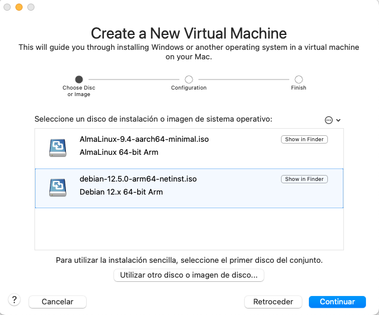
4. Configura els recursos de la màquina virtual.
    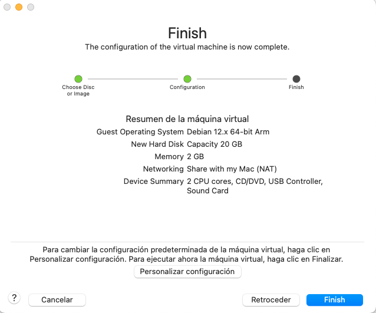

## Instal·lació del sistema operatiu

1. Un cop iniciada la màquina virtual, podeu seleccionar la opció **Install** o bé **Graphical install**.
    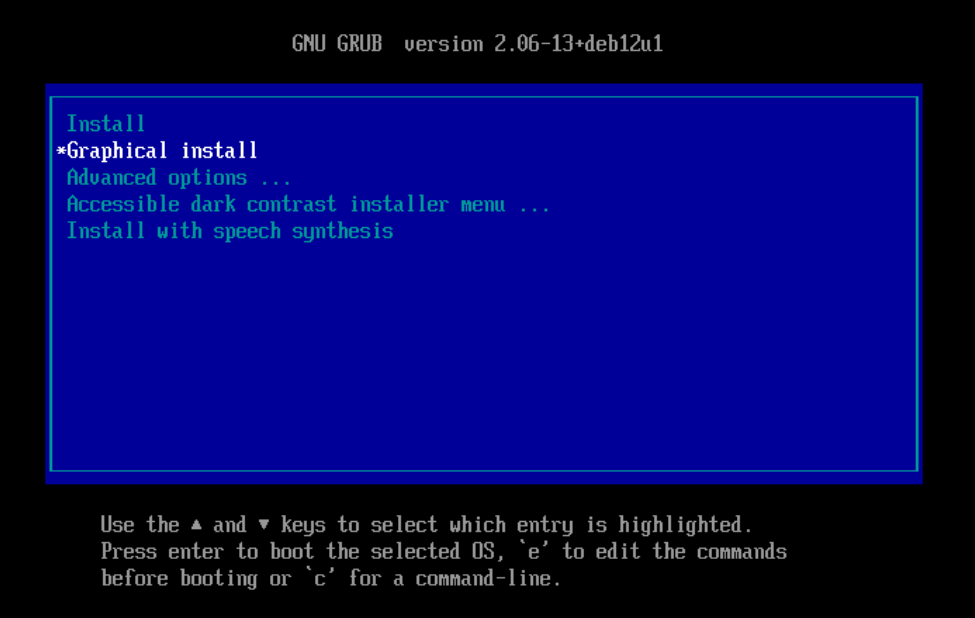

    En aquest tutoriral, seleccionarem la opció **Graphical install** per a una instal·lació més amigable. La principal diferència entre les dues opcions és l'entorn gràfic.

2. Selecciona l'idioma d'instal·lació.
    

    Podeu seleccionar l'idioma que vulgueu per a la instal·lació. En aquest cas, seleccionarem l'idioma **Català**.

3. Selecciona la ubicació geogràfica.
    

    En aquest cas, seleccionarem la ubicació **Espanya**.

4. Selecciona la disposició del teclat.
    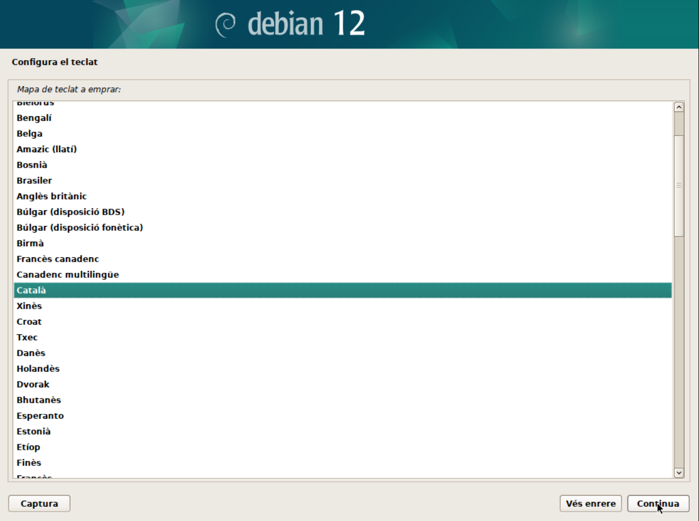

    En aquest cas, seleccionarem la disposició de teclat **Català**. Això ens asegurarà un mapeig correcte del teclat.

5. Espereu que el sistema carregui els components necessaris.
    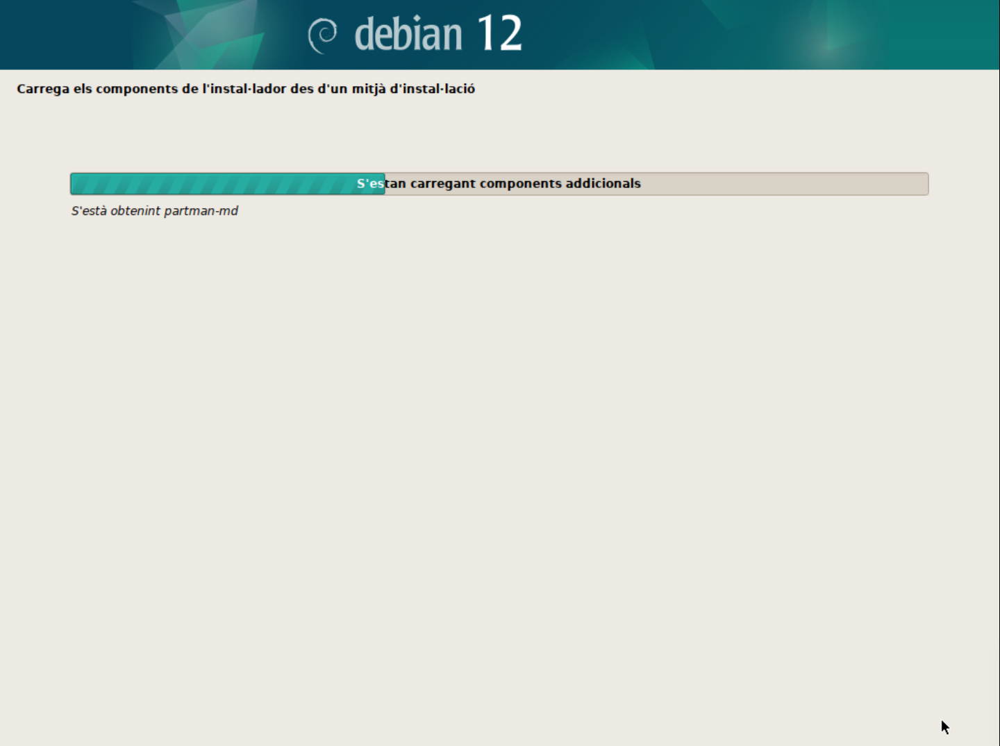

6. Configura la xarxa.

    - El primer pas és configurar el nom d'amfitrió o hostname. Aquest nom permet identificar de forma única el vostre sistema. Podeu deixar el nom per defecte o canviar-lo al vostre gust.
  
    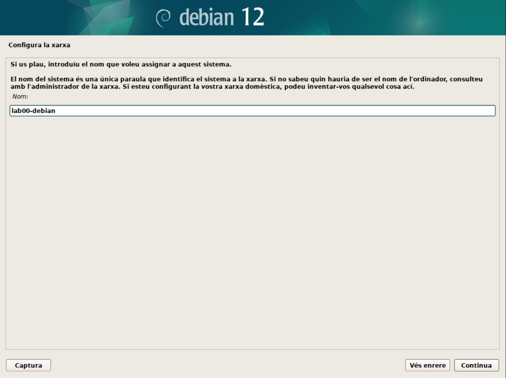

    En aquest cas, hem canviat el nom d'amfitrió a `lab00-debian`, però podeu posar el nom que vulgeu com `debianlab`, etc.
  
    - El segon pas és configurar el domini de la xarxa. Aquest pas el podeu deixar en blanc si no teniu un domini específic. O bé, podem utilitzar `.local` com a domini local per identicar que el servidor pertany a la xarxa local.
  
    

7. Configura l'usuari administrador.

    

    En aquest punt, heu de tenir en compte que si no poseu cap contrasenya, es crearà l'usuari normal amb permisos de `sudo` i això us permetra executar comandes amb privilegis d'administrador.

    Si poseu una contrasenya, aquesta serà la contrasenya de l'usuari `root` i no es crearà un usuari normal amb permisos de `sudo`. I tampoc s'instal·larà el paquet `sudo`.

    > ⚠️ **Compte**
    >
    > Com utilitzarem les màquines virtuals com a laboratoris de pràctiques, no cal que poseu una contrasenya molt segura. Podeu utilitzar una com a `1234`. Però, recordeu que en un entorn real, la seguretat és molt important i cal utilitzar contrasenyes segures.

8. Configura un usuari normal.

    - Nom complet: Podeu posar el vostre nom complet o el que vulgueu.

    

    - Nom d'usuari: Podeu posar el vostre nom d'usuari o el que vulgueu.

    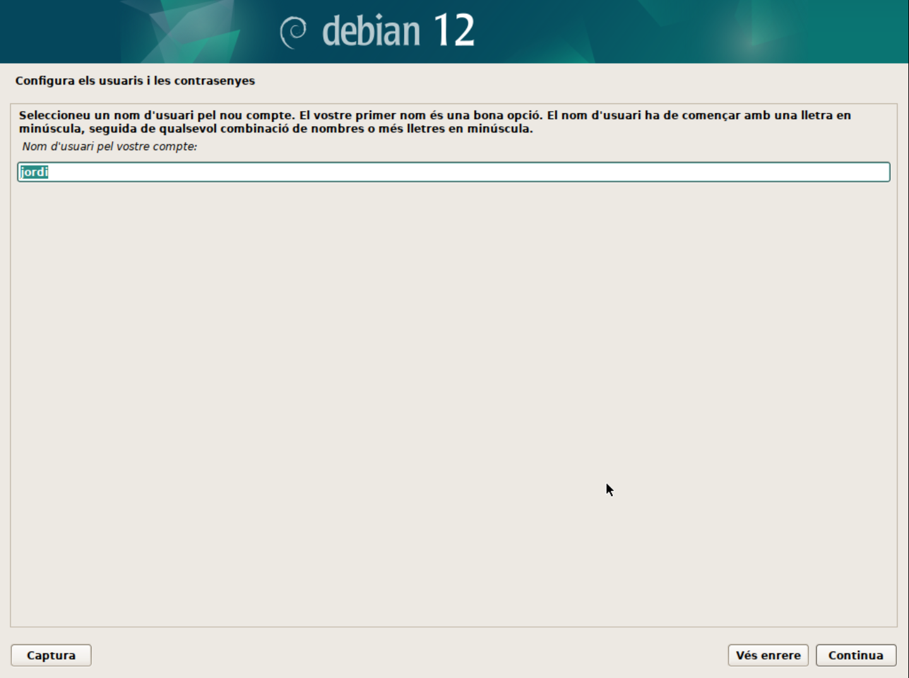

    - Contrasenya: El mateix que per l'usuari `root`.

    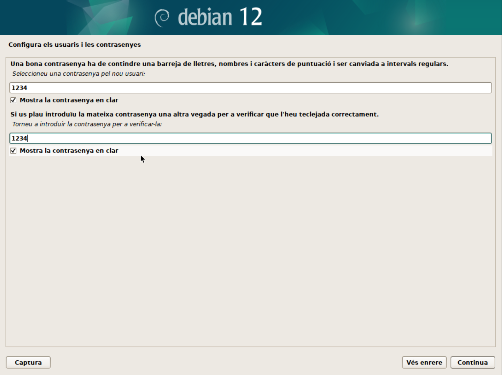

9. Configura la zona horària.

    

    En aquest cas, seleccionarem la zona horària de **Madrid**.

10. Configura el disc dur.

    - Particionament: En aquest curs, el tema del particionament no és molt important. Per tant, podeu fer servir la configuració per defecte més senzilla (**Guiat - utilitzar el disc sencer**). Aquesta configuració crearà les particions necessàries per a l'instal·lació del sistema.
  
    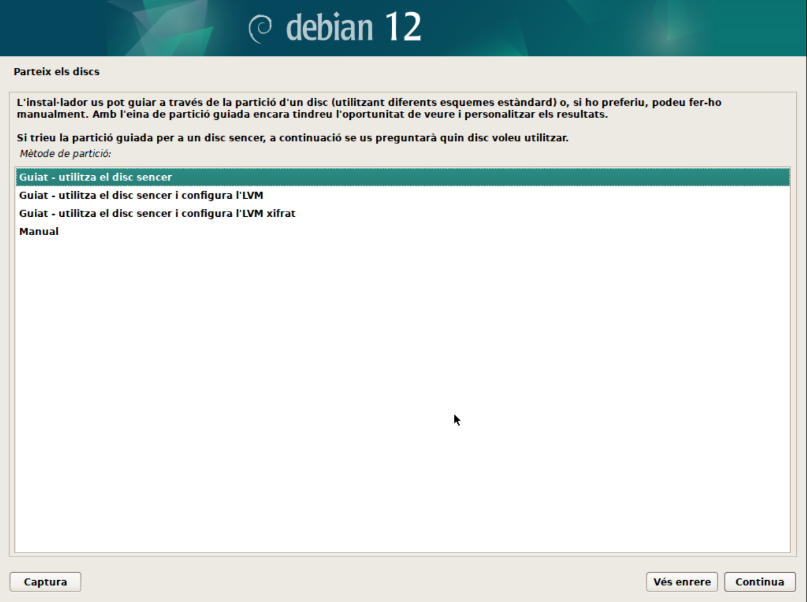

    - Selecciona el disc on instal·lar el sistema. En el meu cas, només tinc un disc virtual amb l'etiqueta `/dev/nvme0n1`. L'etiqueta indica el tipus de disc (NVMe) i el número de disc (1). Es possible tenir altres etiquetes com `/dev/sda` per discos SATA o `/dev/vda` per discos virtuals.

    

    - Particions: Podeu seleccionar (**Tots els fitxers en una partició**) per simplificar la gestió i evitar problemes podeu seleccionar aquesta opció. Aquesta opció crearà una sola partició per a tot el sistema.

    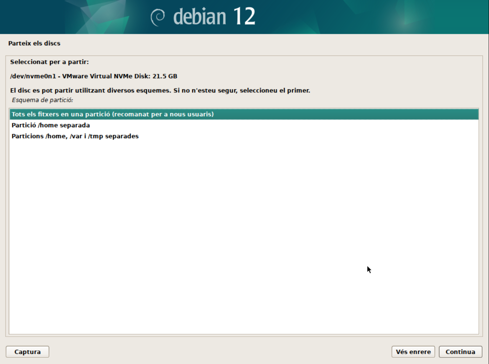

    - Confirmeu els canvis. En aquest punt, el sistema crearà les particions necessàries:
      - La primera partició serà la partició `/boot` on es guardaran els fitxers per arrancar el sistema.
      - La segona partició serà la partició `/` on es guardaran els fitxers del sistema.
      - La tercera partició serà la partició de swap on es guardaran les dades de la memòria virtual.

    > ℹ️ **Què és la partició swap?**
    >
    > La `swap` és una partició especial que s'utilitza com a memòria virtual quan la memòria RAM s'omple. Aquesta partició permet alliberar memòria RAM i evitar que el sistema es bloquegi.
  
    

    - Escriu els canvis al disc.

    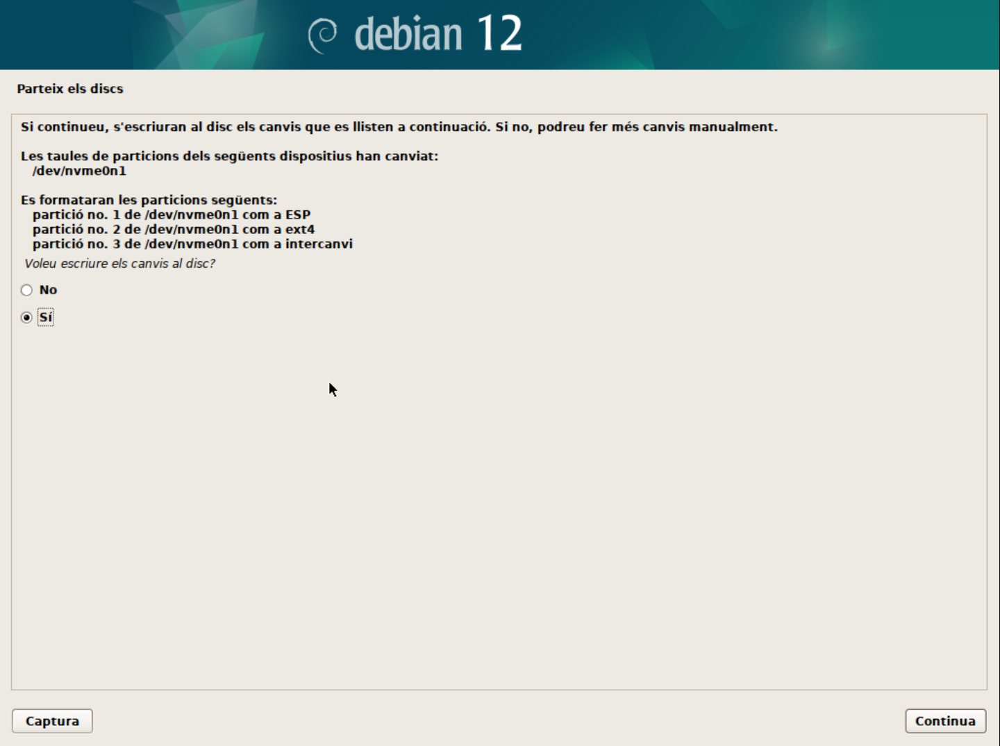

11. Espera que s'instal·li el sistema.

    

12. Configura el gestor de paquets.

    - Analitzar els discos de la instal·lació. Aquest pas permet seleccionar els discos on es troben els paquets d'instal·lació. Normalment, aquest pas no cal modificar-lo.

    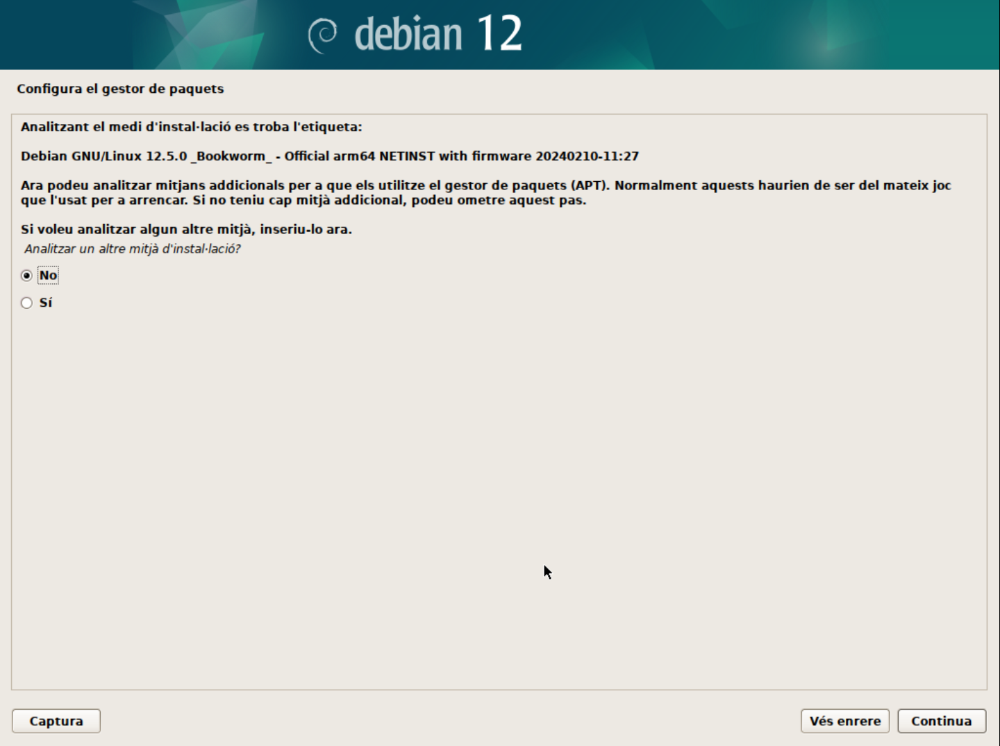

    - Configura el gestor de paquets. En aquest cas, seleccionarem el servidor de paquets més proper a la nostra ubicació.

        - Filtrar els servidors de paquets per ubicació.
            

        - Seleccionar el servidor de paquets.
            

        > 👀 **Nota**:
        >
        > A vegades, els servidors de paquets poden estar saturats o no funcionar correctament. En aquest cas, podeu seleccionar un servidor alternatiu o provar més tard.

    - Configura el proxy. Si esteu darrere d'un proxy, podeu configurar-lo en aquest pas.

        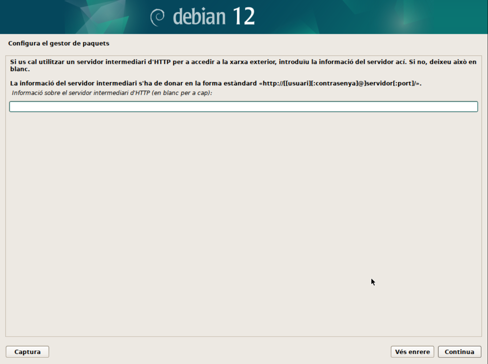

        > ℹ️ **Què és un proxy?**
        >
        > Un proxy és un servidor intermediari entre el vostre sistema i Internet. Aquest servidor pot ser utilitzat per controlar l'accés a Internet, per protegir la vostra privacitat o per accelerar la connexió a Internet. Les peticions de connexió a Internet es fan a través del servidor proxy, que actua com a intermediari i reenvia les peticions al servidor de destinació. Per exemple, en una empresa, el proxy pot ser utilitzat per controlar l'accés a Internet dels empleats i protegir la xarxa interna de possibles amenaces.

13. Espera que s'instal·lin els paquets.

    

14. Configura el paquet `popularity-contest`.

    - Aquest paquet permet enviar informació anònima sobre els paquets instal·lats al servidor de Debian per millorar la selecció de paquets i la qualitat dels paquets. Podeu seleccionar si voleu participar en aquest programa o no.

    

15. Selecció de programari. En aquest punt podeu seleccionar si voleu un servidor en mode text o amb interfície gràfica. També us permet seleccionar si voleu instal·lar els serveis web i ssh al servidor i finalment si voleu les utilitats estàndard del sistema. Seleccionarem el servidor en mode text, el servei SSH activat i les utilitats estàndard del sistema.

    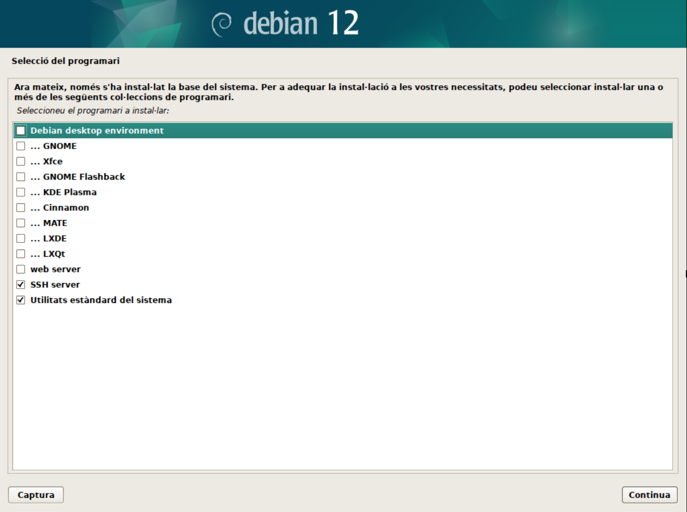

    > ℹ️ **Què és un servidor en mode text?**
    >
    > Un servidor en mode text és un servidor que no té una interfície gràfica. Això significa que tota la interacció amb el servidor es fa a través de la línia de comandes. Aquest tipus de servidor és molt comú en entorns de producció, ja que consumeix menys recursos i és més segur que un servidor amb interfície gràfica.

    ---

    > ℹ️ **Què és el servei SSH?**
    >
    > El servei SSH (Secure Shell) és un protocol de xifratament que permet connectar-se de forma segura a un servidor remot. Aquest servei és molt utilitzat per administrar servidors a distància, ja que permet accedir al servidor de forma segura i xifratada.

16. Espera que s'instal·li el programari.

    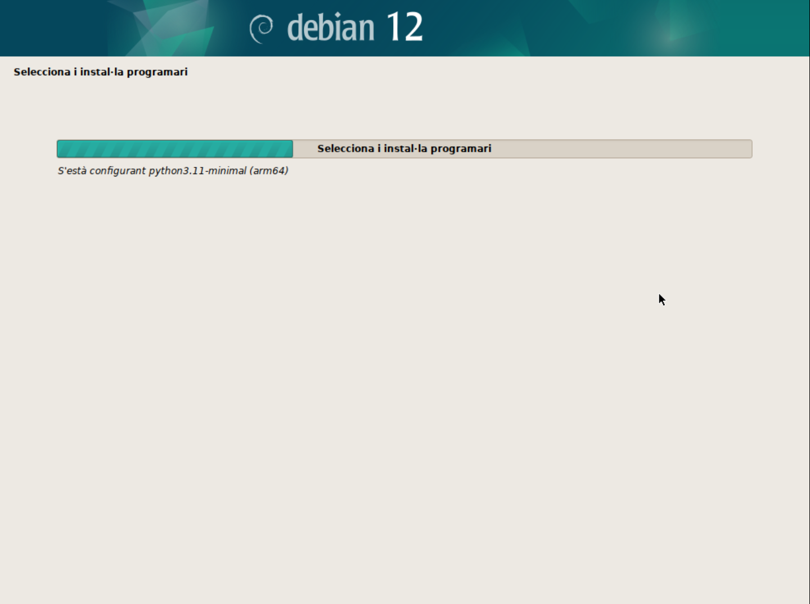

17. Instal·lació acabada. Un cop finalitzada la instal·lació, el sistema es reiniciarà i podreu accedir al GRUB per seleccionar el sistema operatiu.
    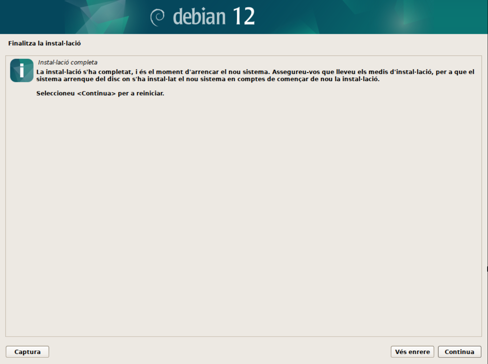

18. El GRUB us permet accedir al sistema operatiu. En aquest cas, seleccionarem Debian GNU/Linux. La resta d'opcions les veurem més endavant en el curs.

    

    > ℹ️ Què és el GRUB?
    >
    > Com veurem l'any vinent a Administració de Sistemes, el GRUB és un gestor d'arrencada que permet seleccionar el sistema operatiu que volem iniciar. Aquest gestor és molt útil en sistemes amb múltiples sistemes operatius o múltiples versions del mateix sistema operatiu.

19. Inicieu sessió amb l'usuari i la contrasenya que heu configurat durant la instal·lació.

    

20. Tanqueu la sessió amb la comanda `exit`.

21. Inicieu sessió amb l'usuari `root` i la contrasenya que heu configurat durant la instal·lació.

    
